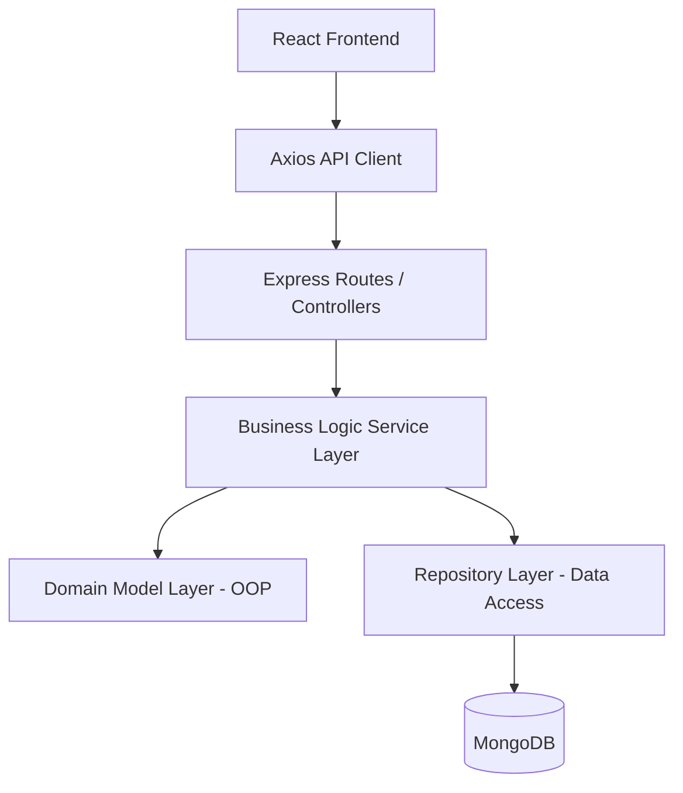
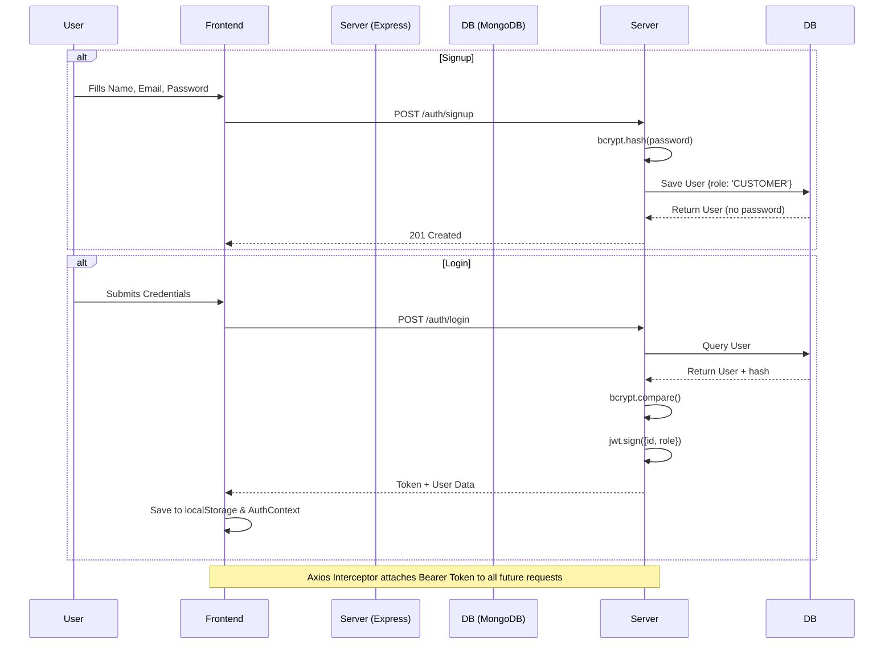
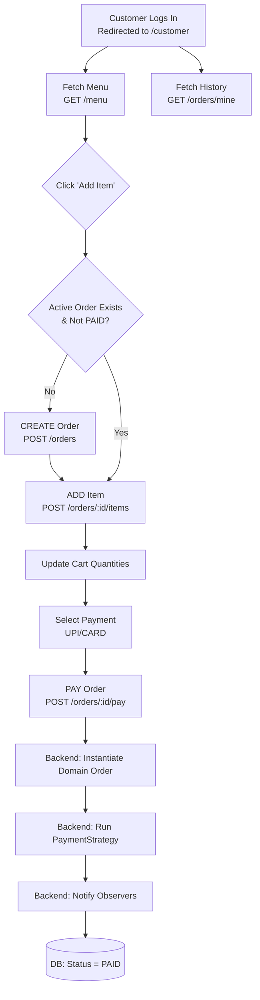
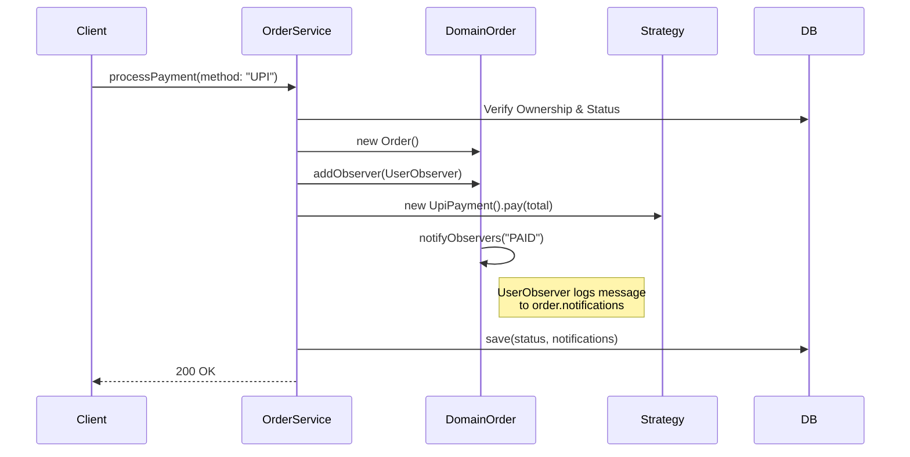
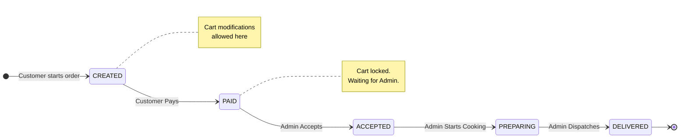
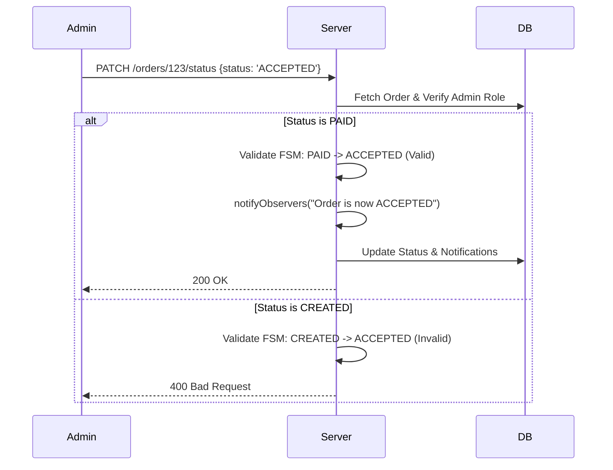

# QuickBite 
**A Scalable, enterprise-grade Food Ordering System built with Clean Architecture & advanced OOP Principles.**

QuickBite is a demonstration of how modern web technologies (React + Node.js) can be combined with classical software design patterns (Strategy, Observer, Repository) to build a robust and maintainable platform.

---

## Technology Stack
### Frontend
- **Framework**: React 18 (Vite)
- **Styling**: Tailwind CSS (Premium Dark Theme)
- **Navigation**: React Router 6
- **State**: Context API
- **Icons**: Lucide React

### Backend
- **Runtime**: Node.js & TypeScript
- **Web Framework**: Express.js
- **Database**: MongoDB (Mongoose)
- **Authentication**: JWT (JSON Web Tokens)
- **Security**: BcryptJS (Password Salting)

---

## System Architecture
QuickBite follows a **Layered Clean Architecture** to ensure high cohesion and low coupling.



### Core Design Patterns
1.  **Strategy Pattern**: Used for polymorphic payment processing (`UPI`, `Card`).
2.  **Observer Pattern**: Used for real-time order status notifications.
3.  **Repository Pattern**: Abstracts database calls away from business logic.

---
# Visual Application Flow


## Authentication & Security Flow

The system uses standard JWT stateless authentication. The token acts as the single source of truth for a user's role.



---

## The Customer Journey (Order Lifecycle)

The customer flow heavily relies on the backend managing state and the frontend recovering from state mismatches gracefully.



### Advanced Detail: Payment Processing
When the user hits "Pay", the backend uses multiple design patterns securely:



---

## The Admin Journey & Status State Machine

The Admin portal is essentially an interface to a strict Finite State Machine (FSM) running on the backend.



### Admin FSM Enforcement Flow


---

## Architectural Summary

1. **Thick Engine, Thin Repo**: The UI handles display logic, and MongoDB acts as dumb storage. The "Brain" validating all rules, states, and ownership sits firmly in `OrderService.ts`.
2. **Resilient Cart Sessions**: The client catches `400 Bad Request` if it attempts to add an item to a `PAID` order on a stale tab, and instantly spins up a new order.
3. **Event-Driven Audit Trails**: Because the `UserObserver` listens for status changes and writes them directly to the `notifications` array, the system gets a free, timestamped audit log of every lifecycle event.


##  Project Structure Overview
```
QuickBite/
├── backend/
│   ├── config/         # DB connection config
│   ├── db/             # Mongoose schemas/models
│   ├── interfaces/      # TS interfaces for patterns
│   ├── middleware/      # Auth & RBAC logic
│   ├── models/          # Domain OOP classes
│   ├── observers/       # Observer pattern implementations
│   ├── repositories/    # Data access layer
│   ├── services/        # Business logic layer
│   ├── strategies/      # Strategy pattern (Payment)
│   └── server.ts        # Express entry point & routes [REFACTOR TARGET]
├── frontend/
│   └── ...
└── ...
```

## Detailed Class Reference

### Domain Models (`backend/models`)

#### `User`
- **Properties**:
  - `id: number`: Unique identifier.
  - `name: string`: Full name of the user.
- **Methods**:
  - `constructor(id: number, name: string)`: Initializes the user.

#### `Customer` (extends `User`)
- **Properties**: Inherits from `User`.
- **Methods**: 
  - `constructor(id: number, name: string)`: Calls `super(id, name)`.

#### `RestaurantOwner` (extends `User`)
- **Properties**: Inherits from `User`.
- **Methods**: 
  - `constructor(id: number, name: string)`: Calls `super(id, name)`.

#### `MenuItem`
- **Properties**:
  - `id: number`: Unique identifier.
  - `name: string`: Item name.
  - `price: number`: Item price.
- **Methods**:
  - `constructor(id: number, name: string, price: number)`: Initializes the item.

#### `Order`
- **Properties**:
  - `id: string`: Unique identifier (User ID).
  - `status: string`: Current status (`CREATED`, `PREPARING`, etc.).
  - `observers: Observer[]`: List of subscribers for status changes.
  - `items: MenuItem[]`: List of items in the order.
  - `paymentStrategy: PaymentStrategy | null`: Selected payment method.
  - `payment: Payment | null`: Payment record.
  - `notifications: string[]`: History of updates/notifications.
- **Methods**:
  - `addItem(item: MenuItem)`: Adds an item to the order.
  - `getTotalAmount(): number`: Calculates total price based on items and quantities.
  - `addObserver(observer: Observer)`: Registers a new observer.
  - `setPaymentStrategy(strategy: PaymentStrategy)`: Assigns a payment method.
  - `processPayment()`: Executes payment via the assigned strategy.
  - `notifyObservers(status: string)`: Notifies all observers of a change.
  - `updateStatus(newStatus: string)`: Validates and updates the order status.

#### `Payment`
- **Properties**:
  - `amount: number`: Total paid.
  - `method: string`: Method used (e.g., `CardPayment`, `UpiPayment`).
- **Methods**:
  - `constructor(amount: number, method: string)`: Initializes the payment record.

### Services (`backend/services`)

#### `OrderService`
- **Properties**:
  - `repo: any`: Instance of `OrderRepository`.
- **Methods**:
  - `createOrder(userId: string)`: Creates a new order record in DB.
  - `addItem(orderId, itemId, user)`: Adds an item to an existing order with ownership check.
  - `updateItemQuantity(orderId, index, action, user)`: Increments/Decrements item quantity.
  - `removeItem(orderId, index, user)`: Removes an item from the cart.
  - `processPayment(orderId, strategy, user)`: Orchestrates payment processing, observer notification, and status transition.
  - `updateStatus(orderId, newStatus, user)`: (Admin only) Updates order status and notifies observers.
  - `getOrder(orderId, user)`: Fetches a single order with accessibility check.
  - `getUserOrders(userId)`: Fetches all orders for a specific customer.

#### `MenuService`
- **Properties**:
  - `menuRepo: MenuRepository`: Instance of `MenuRepository`.
- **Methods**:
  - `getAllItems()`: Fetches all items from the menu.
  - `addItem(itemData)`: Validates and adds a new item to the menu.
  - `deleteItem(id)`: Removes an item from the menu by ID.

### Repositories (`backend/repositories`)

#### `MongoOrderRepository`
- **Methods**:
  - `create(order)`: Persists a new order to MongoDB.
  - `findById(id)`: Fetches an order by its MongoDB ID.
  - `update(id, updateData)`: Updates an existing order.
  - `getAll()`: Fetches all orders (Admin).
  - `findByUserId(userId, limit)`: Fetches recent orders for a specific user.

#### `MenuRepository`
- **Methods**:
  - `findAll()`: Returns all menu items.
  - `create(itemData)`: Saves a new menu item.
  - `deleteById(id)`: Deletes a menu item.
  - `findById(id)`: Fetches a single menu item.

### Design Patterns Implementation

#### `UpiPayment` / `CardPayment` (implements `PaymentStrategy`)
- **Methods**:
  - `pay(amount: number)`: Logs/Processes payment for the specific method.

#### `UserObserver` (implements `Observer`)
- **Methods**:
  - `update(order, message)`: Appends a notification message to the order's history.

---

## Security & Role-Based Access (RBAC)
- **Authentication**: JWT tokens issued on login, stored in `localStorage`.
- **Authorization**: Middleware intercepts all sensitive routes.
    - `authorize('CUSTOMER')`: Restricts route to customers only.
    - `authorize('ADMIN')`: Restricts route to administrators only.
- **Password Safety**: Passwords are never stored in plain text; salted and hashed via `bcrypt`.

---

## Getting Started

### Prerequisites
- Node.js (v18+)
- Local MongoDB instance

### Installation
1. **Clone the repo**
2. **Setup Backend**
   ```bash
   cd QuickBite
   npm install
   npm start
   ```
3. **Setup Frontend**
   ```bash
   cd frontend
   npm install
   npm run dev
   ```

---
