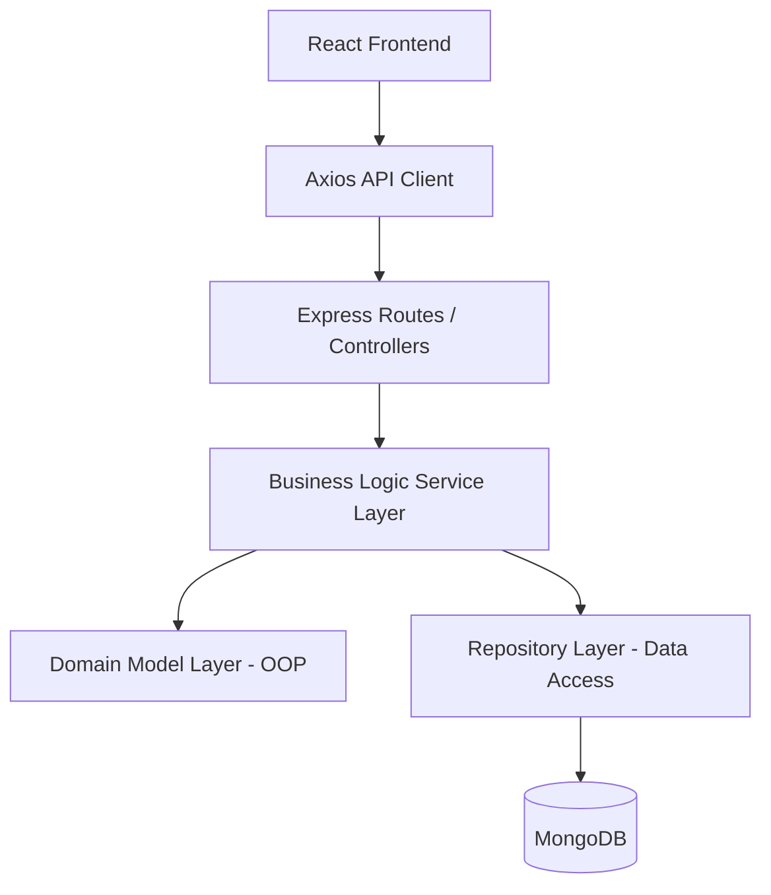

# QuickBite 🍔
**A Scalable, enterprise-grade Food Ordering System built with Clean Architecture & advanced OOP Principles.**

QuickBite is a demonstration of how modern web technologies (React + Node.js) can be combined with classical software design patterns (Strategy, Observer, Repository) to build a robust and maintainable platform.

---

## 🚀 Quick Links
- [Master System Design Document](file:///Users/ayusharyan/.gemini/antigravity/brain/b96600e2-fd03-450a-9da0-126cb7c3e5a5/system_design.md)
- [Architecture Overview](file:///Users/ayusharyan/Desktop/Quickbite_github/QuickBite/docs/design.md)

---

## 🛠 Technology Stack
### Frontend
- **Framework**: React 18 (Vite)
- **Styling**: Tailwind CSS (Premium Dark Theme)
- **Navigation**: React Router 6
- **State**: Context API
- **Icons**: Lucide React

### Backend
- **Runtime**: Node.js & TypeScript
- **Web Framework**: Express.js
- **Database**: MongoDB (Mongoose)
- **Authentication**: JWT (JSON Web Tokens)
- **Security**: BcryptJS (Password Salting)

---

## 🏗 System Architecture
QuickBite follows a **Layered Clean Architecture** to ensure high cohesion and low coupling.



### Core Design Patterns
1.  **Strategy Pattern**: Used for polymorphic payment processing (`UPI`, `Card`).
2.  **Observer Pattern**: Used for real-time order status notifications.
3.  **Repository Pattern**: Abstracts database calls away from business logic.

---

## 📚 Detailed Class Reference

### Domain Models (`backend/models`)

#### `Order`
The heart of the state machine.
- **Attributes**:
    - `id`: Unique identifier.
    - `status`: Current lifecycle phase (`CREATED`, `PAID`, `PREPARING`, `DELIVERED`).
    - `items`: Collection of `MenuItem` objects.
    - `paymentStrategy`: The active payment implementation.
- **Key Methods**:
    - `addItem(item)`: Validates and adds item to order.
    - `getTotalAmount()`: Calculates total via `reduce`.
    - `updateStatus(status)`: Transitions the status and triggers observers.

#### `User` (Base) -> `Customer` & `Admin`
- **Logic**: Implements inheritance to separate customer browsing from admin management.

### Services (`backend/services`)

#### `OrderService`
Orchestrates the lifecycle between the database and the domain models.
- **`processPayment()`**:
    - Fetches order from `Repository`.
    - Initializes Domain `Order`.
    - Injects observer.
    - Executes specified `PaymentStrategy`.
    - Persists state back to `Repository`.

---

## 🔐 Security & Role-Based Access (RBAC)
- **Authentication**: JWT tokens issued on login, stored in `localStorage`.
- **Authorization**: Middleware intercepts all sensitive routes.
    - `authorize('CUSTOMER')`: Restricts route to customers only.
    - `authorize('ADMIN')`: Restricts route to administrators only.
- **Password Safety**: Passwords are never stored in plain text; salted and hashed via `bcrypt`.

---

## 📦 Getting Started

### Prerequisites
- Node.js (v18+)
- Local MongoDB instance

### Installation
1. **Clone the repo**
2. **Setup Backend**
   ```bash
   cd QuickBite
   npm install
   npm start
   ```
3. **Setup Frontend**
   ```bash
   cd frontend
   npm install
   npm run dev
   ```

---
*© 2026 QuickBite Team • Excellence in Software Engineering*