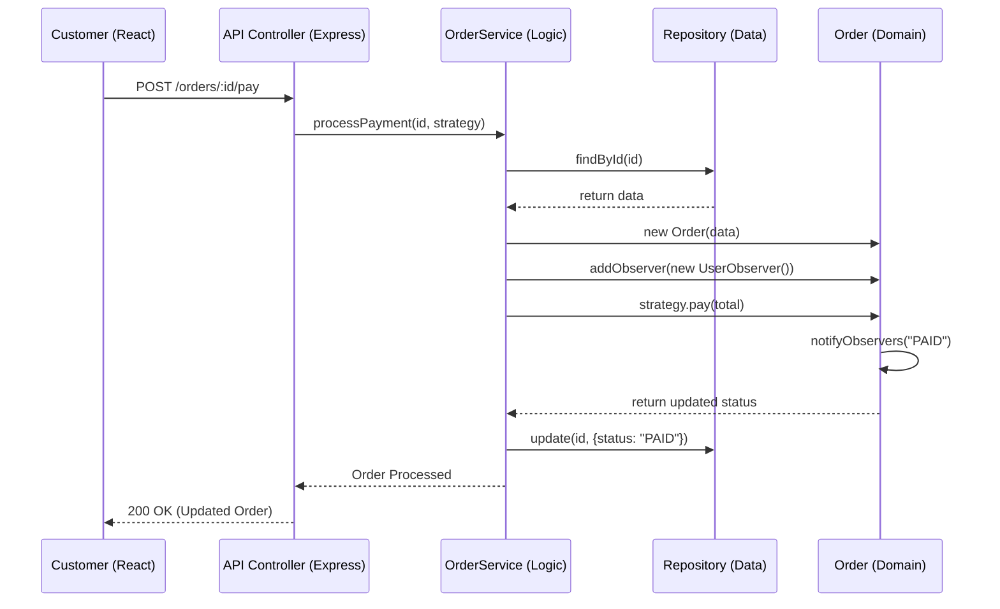

# QuickBite: SOLID Principles & System Design Analysis 🏗️

This document explains how the QuickBite project implements industry-standard software engineering principles to ensure the codebase is scalable, maintainable, and robust.

---

## 1. The SOLID Principles in QuickBite

### **S - Single Responsibility Principle (SRP)**
*Each class has one, and only one, reason to change.*

*   **`Order.ts` (Domain Model)**: This class is solely responsible for the business logic of an order (calculating totals, maintaining notification history). It knows nothing about databases or HTTP.
*   **`MongoOrderRepository.ts`**: This class is exclusively responsible for communicating with MongoDB. If we switched to PostgreSQL, only this file would change.
*   **`OrderService.ts`**: This class only handles the "orchestration"—it connects the repository with the domain model to process a complete business action.

### **O - Open/Closed Principle (OCP)**
*Software entities should be open for extension, but closed for modification.*

*   **Payment Implementation**: We used the **Strategy Pattern** here. If you want to add a new "Crypto" payment method, you simply create a `CryptoPayment.ts` class that implements `PaymentStrategy`. You **don't** have to change a single line of code in `OrderService.ts` to support it.

### **L - Liskov Substitution Principle (LSP)**
*Subtypes must be substitutable for their base types.*

*   **Payment Strategies**: Both `UpiPayment` and `CardPayment` implement the `PaymentStrategy` interface. In `OrderService`, the code doesn't care which one is passed in; they both fulfill the contract without breaking the app.

### **I - Interface Segregation Principle (ISP)**
*Clients should not be forced to depend on methods they do not use.*

*   **Focused Interfaces**: Instead of one "God Interface" that handles Orders, Users, and Payments, we use small, focused interfaces like `PaymentStrategy` and `Observer`. This ensures classes like `CardPayment` only have to implement the `pay()` method they actually need.

### **D - Dependency Inversion Principle (DIP)**
*Depend on abstractions, not on concrete implementations.*

*   **Repository Decoupling**: In `OrderService.ts`, the constructor expects an `OrderRepository`. It doesn't care if it's a `MongoOrderRepository` or a `LocalJSONRepository`. The high-level logic (Service) is protected from changes in the low-level detail (Database).

---

## 2. Core OOP Concepts Used

### **Encapsulation**
Encapsulation is the bundling of data and the methods that operate on that data into a single unit (a class), while restricting direct access to some components.
*   **Example**: In `models/Order.ts`, you cannot directly edit the `notifications` array from the outside. Instead, you call `notifyObservers(message)`, which encapsulates the logic of adding the message to the internal list and notifying listeners.

### **Inheritance**
Inheritance allows a class to inherit attributes and methods from another class.
*   **Example**: In our Role-Based system, different User types (like `Customer` or `Admin`) inherit core properties like `id`, `name`, and `email` from a base `User` structure, reducing code duplication.

### **Polymorphism**
The ability of different classes to be treated as instances of a same parent class through a common interface.
*   **Example**: `strategy.pay(total)` is polymorphic. Depending on what was passed in, it might trigger the UPI logic or the Credit Card logic, but the caller doesn't need to know the difference.

---

## 3. System Design Patterns

### **1. Strategy Pattern (Payment)**
We use this to handle multiple payment methods. It makes the system flexible and easy to expand.
*   **Key Files**: `interfaces/PaymentStrategy.ts`, `strategies/UpiPayment.ts`, `strategies/CardPayment.ts`.

### **2. Observer Pattern (Status Updates)**
We use this to notify users of status changes automatically. When an order status is updated, the "Subject" (the Order) notifies all "Observers" (like the notification logger).
*   **Key Files**: `observers/UserObserver.ts`, `models/Order.ts`.

### **3. Repository Pattern (Data Access)**
This abstracts the database logic away from the business logic. It allows us to swap database providers easily and makes unit testing much simpler.
*   **Key Files**: `repositories/MongoOrderRepository.ts`.

---

## 4. Layered Architecture (The "Clean" Flow)
The project is built using a 6-layer approach to ensure maximum separation of concerns:
`Frontend (React)` → `API (Axios)` → `Controller (Express)` → `Service (Business Logic)` → `Repository (Data Access)` → `Domain (Pure OOP Logic)`

---

## 5. Logical Data Flow

---
