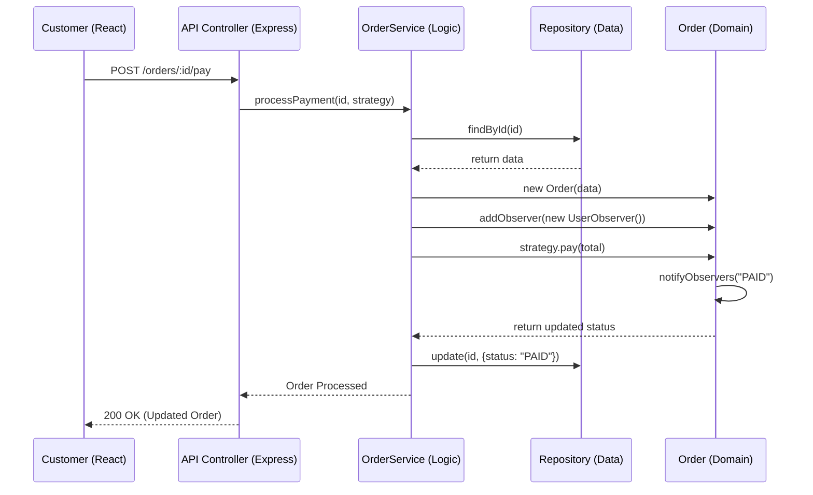

# QuickBite Technical Design Document

QuickBite is a high-performance, scalable food ordering system engineered for reliability and maintainability. This document outlines the technical architecture, design philosophies, and implementation details of the platform.

---

## 1. System Philosophy & Architecture

The system is built on a **Layered Clean Architecture** that ensures complete isolation between high-level business logic and low-level technical infrastructure.

### 1.1. Architectural Layers
- **Presentation Layer (React)**: Professional, dark-themed UI built with Vite and Tailwind CSS.
- **Application Layer (Express / Services)**: Orchestrates the business processes like ordering and payments.
- **Domain Layer (Pure OOP)**: Contains the core business entities and logic, independent of the web framework.
- **Persistence Layer (Mongoose / MongoDB)**: Manages data storage and retrieval via an abstracted repository pattern.

---

## 2. Object-Oriented Design (OOP) Implementation

QuickBite serves as a reference implementation for advanced OOP concepts:

### 2.1. Encapsulation
The `Order` class encapsulates the order's state (items, status, notifications). Direct modification of sensitive data is restricted; changes are channeled through controlled methods like `updateStatus()`.

### 2.2. Inheritance & Role-Based Design
```typescript
// backend/models/Customer.ts
class Customer extends User { ... }

// backend/models/RestaurantOwner.ts
class RestaurantOwner extends User { ... }
```
Role-specific logic is cleanly separated through inheritance from a common `User` base class.

### 2.3. Polymorphism & Abstraction
The system uses **Strategy Pattern** for payments. The `OrderService` interacts with a `PaymentStrategy` interface, allowing multiple payment methods (UPI, Card) to be used interchangeably at runtime.

---

## 3. Design Patterns Deep Dive

### 3.1. Strategy Pattern (Payment)
We decouple the payment processing from the order logic.
- **Interface**: `PaymentStrategy`
- **Concrete Implementations**: `UpiPayment`, `CardPayment`
- **Benefit**: New payment methods (like Apple Pay or Crypto) can be added with zero changes to existing order logic.

### 3.2. Observer Pattern (Real-time Updates)
Ensures that users receive immediate feedback when their order status changes.
- **Subject**: `Order`
- **Observer**: `UserObserver`
- **Flow**: `updateStatus` ➔ `notifyObservers` ➔ `obs.update`

---

## 4. Detailed Component Reference

### 4.1. Core Classes & Services

| Component | Responsibility | Key Methods |
| :--- | :--- | :--- |
| **`Order`** | Domain Logic | `addItem()`, `getTotalAmount()`, `updateStatus()` |
| **`OrderService`** | Process Orchestration | `processPayment()`, `createOrder()`, `addItem()` |
| **`MenuService`** | Inventory Management | `getAllItems()`, `addItem()` |
| **`MongoOrderRepository`** | Data Access | `findByUserId()`, `update()`, `create()` |

### 4.2. Security Architecture (JWT + RBAC)
QuickBite uses a robust **Role-Based Access Control** (RBAC) system:
- **Authentication**: JWT tokens issued containing `id` and `role`.
- **Interceptors**: Frontend Axios clients automatically inject the token.
- **Guard Rails**: Backend middleware `authorize('ADMIN')` or `authorize('CUSTOMER')` protects sensitive endpoints.

---

## 5. Logical Data Flow



---
*Generated by QuickBite Engineering Group • 2026*